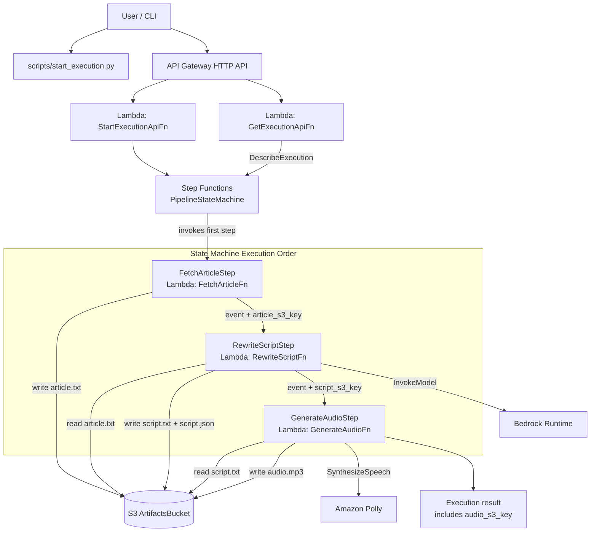

# Infrastructure Notes

This directory contains the AWS CDK app for the `PodcastAnythingStack`.

## What This Stack Creates

- `ArtifactsBucket` (S3)
  - Bucket name comes from `MP_BUCKET`.
  - `auto_delete_objects=True` and `removal_policy=DESTROY` for clean teardown.
- `PythonDepsLayer` (Lambda Layer)
  - Built from `infra/layers/requirements.txt` using Docker during synth/deploy.
- `FetchArticleFn` (Lambda, Python 3.11)
  - Handler: `podcast_anything.handlers.fetch_article.handler`
- `RewriteScriptFn` (Lambda, Python 3.11)
  - Handler: `podcast_anything.handlers.rewrite_script.handler`
- `GenerateAudioFn` (Lambda, Python 3.11)
  - Handler: `podcast_anything.handlers.generate_audio.handler`
- `PipelineStateMachine` (Step Functions)
  - Sequence: `FetchArticleStep -> RewriteScriptStep -> GenerateAudioStep`
- `StartExecutionApiFn` (Lambda, Python 3.11)
  - Handler: `podcast_anything.api.handlers.start_execution_handler`
- `GetExecutionApiFn` (Lambda, Python 3.11)
  - Handler: `podcast_anything.api.handlers.get_execution_handler`
- `PodcastAnythingHttpApi` (API Gateway HTTP API)
  - Route: `POST /executions` -> `StartExecutionApiFn`
  - Route: `GET /executions` -> `GetExecutionApiFn`

## Permissions

- All three Lambdas get read/write access to `ArtifactsBucket`.
- `RewriteScriptFn` can call Bedrock:
  - `bedrock:InvokeModel`
  - `bedrock:InvokeModelWithResponseStream`
- `GenerateAudioFn` can call Polly:
  - `polly:SynthesizeSpeech`
- `StartExecutionApiFn` can start the deployed Step Functions state machine.
- `GetExecutionApiFn` can call `states:DescribeExecution`.

## Required Environment Variables (at synth/deploy time)

- `MP_BUCKET`
- `BEDROCK_MODEL_ID`

Optional:
- `POLLY_VOICE_ID` (default: `Joanna`)
- `AWS_REGION` (default used by app: `us-east-1`)

## Stack Outputs

- `ArtifactsBucketName`
- `FetchArticleFnName`
- `RewriteScriptFnName`
- `GenerateAudioFnName`
- `PipelineStateMachineArn`
- `StartExecutionApiFnName`
- `GetExecutionApiFnName`
- `HttpApiUrl`

`scripts/start_execution.py` can look up `HttpApiUrl` (default mode) or `PipelineStateMachineArn` (`--mode direct`) from these outputs.

## Architecture Sketch

Execution summary:
- Input event starts in Step Functions with `job_id` and `source_url`.
- Steps run in strict order: `fetch -> rewrite -> generate`.
- Each step adds new keys to the event payload and passes it to the next step.
- Final artifacts are stored under `jobs/<job_id>/` in S3.
